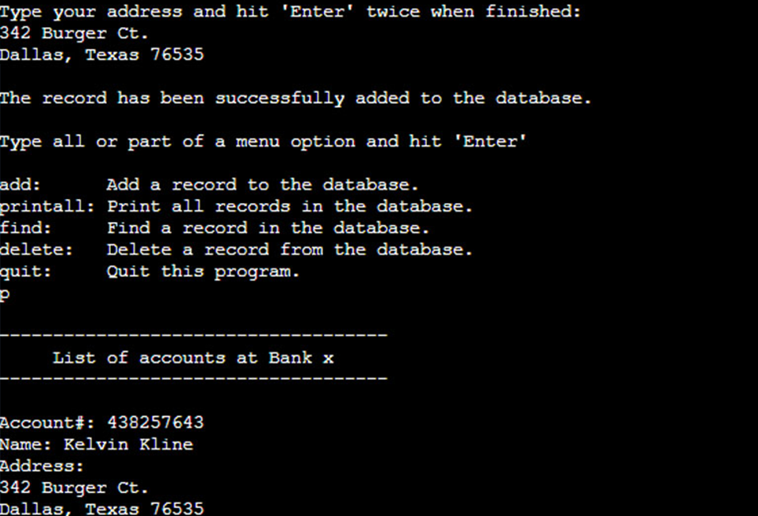

This semester has facilitated the largest growth I've seen in myself as a software developer so far. The three Computer Science major-related courses I took were:
<li>
    MAT-307: Linear Algebra
</li>
<li>
    ICS-311: Algorithms
</li>
<li>
    ICS-314: Software Engineering I
</li>
 

While ICS-311 and MAT-307 introduced me to many useful mathematical concepts which were more advanced than anything I'd learned before, I would say that ICS-314 has provided me with the most value in terms of immediate returns. It did so by introducing me to practical and modern software development. Specifically, it demonstrated to me the utility of Github and taught me how to use an entire technology stack with which I can now use to develop modern web applications. Though I was often somewhat disoriented due to the rapid rate at which concepts and technologies were being thrown at me, everything we learned came together cohesively during the creation of my final project.

<h2>
Project Management
</h2>
The final project for this course was easily the most productive and satisfying group project I've ever been a part of. One of the major contributing factors to the productivity of this project was the use of Issue Driven Project Management. As the name implies, this style of project management consists of identifying issues to be worked on and using these issues to divide labor among group members and track progress of the overall project. Using this style of project management through a Github repository resulted in a high rate of productivity and smooth collaboration. It was a very effective method for dividing labor and tracking progress, and allowed group members to work at their own pace without doing redundant work or interfering with each other.

    

        
    

    

        
    

    

        <small>
            A screenshot of the final project from my favorite course last semester.
        </small>
    

    

        <small>
        The main page of my final project from my favorite course this semester.
        </small>    
    

 
 

<h2>

Tech Stack
</h2>

The technologies I learned to use in this course built on all of my prerequisite coding experience and allowed me to finally create something that has the potential to see the light of day. I got the pleasure of coding in Javascript, which shocked me by how easy it is to use and by the amount of functionality that's built into it. I learned how to use the React library to easily create pleasant user interfaces. Though my prior knowledge of databases is lacking, I learned how to use the document-oriented database program MongoDB. Using all of these technologies through the Meteor framework and the integrated development environment IntelliJ IDEA, my group was able to build a web application with more functionality built into it than I was confident we could accomplish at the start. Though the final product is incomplete, it is a well-functioning prototype, and I'm confident that we could polish it into a useful tool with actual users if we were to work on it some more.

 