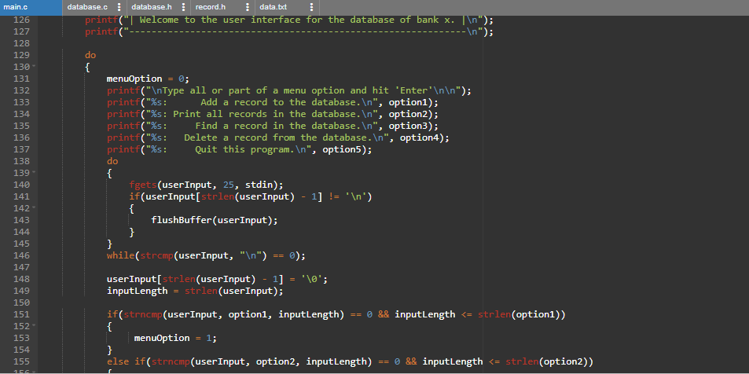

This is an individual project I completed in ICS 212, Fall 2021. Doing this project helped me learn how to compile a C application with multiple source files, how to use a Makefile, and how to implement a simple linked list data structure using principles of object-oriented programming.

The user interface was designed to be robust using error handling for all cases of user input.
It accepts user input, stores it in an object on a linked list, and then writes the data to a file upon program termination, which is then read and stored onto the linked list at the next startup.
Another feature of this project is the implementation of a debug mode which can be run by passing a specific command line argument when starting the application.

<pre>Source: <a href="https://github.com/yongsungm/Banking-Database"><i class="large github icon"></i>yongsungm/database-program</a> 
        <a href="https://onlinegdb.com/HNRvy2Pma">Online compiler</a></pre>
 
 